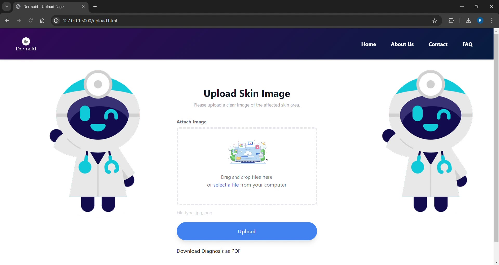
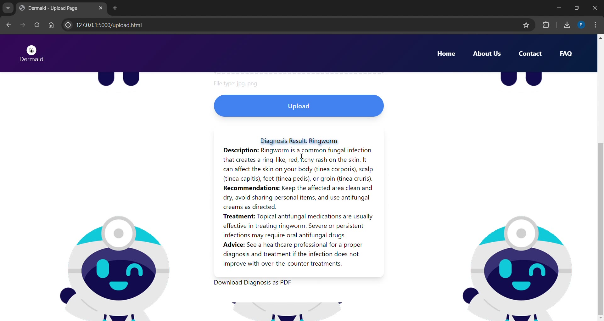

# Dermaid

A web application that classifies nine common skin conditions from an uploaded photograph, using a MobileNetV2 transfer-learning model served through Flask.

Built as my final year project for BSc Computer Engineering at KNUST, 2024.

## This is not a diagnostic tool

It is a classifier trained on a small public dataset for an undergraduate project. It has not been clinically validated, it has not been reviewed by a dermatologist, and it must not be used to make a medical decision.

## What it does

Upload a photograph of a skin condition. The model returns a predicted class along with a plain-language description of that condition and general guidance on next steps.

The nine classes:

| Condition | Type |
|---|---|
| Cellulitis | Bacterial |
| Impetigo | Bacterial |
| Athlete's Foot | Fungal |
| Nail Fungus | Fungal |
| Ringworm | Fungal |
| Cutaneous Larva Migrans | Parasitic |
| Chicken Pox | Viral |
| Shingles | Viral |
| Clear Skin | Negative class |

## The interface



The upload page. A photograph is posted to the Flask app, preprocessed to 128 x 128, and passed to the Keras model loaded in-process. There is no external API call; the model runs on the same machine serving the page.



A returned prediction. The predicted class is paired with a plain-language description, self-care recommendations, treatment notes, and a standing instruction to see a clinician. The result can be exported as a PDF.

### Demo


Upload to result, at 2x speed. The full-length screen recording is at [`docs/dermaid-demo.mp4`](docs/dermaid-demo.mp4).

## The dataset problem

Public dermatology datasets skew heavily toward lighter skin tones. A classifier trained on them will underperform on darker skin, which is exactly the population this project was built for.

That is the motivation for the companion repository, [GAN-FOR-SKIN-COLOUR](https://github.com/radubotchway/GAN-FOR-SKIN-COLOUR), a StarGAN implementation that translates lesion images across skin-tone domains to augment the training set.

## Model

| | |
|---|---|
| Base | MobileNetV2, ImageNet weights, frozen |
| Head | GlobalAveragePooling2D, Dense(128, ReLU), Dense(9, softmax) |
| Input | 128 x 128 RGB, rescaled to [0, 1] |
| Loss | Sparse categorical cross-entropy |
| Optimiser | Adam |
| Training | 20 epochs, 80/20 train and validation split |

MobileNetV2 was chosen for its size. The model has to load and run inference inside a Flask process on modest hardware, which rules out heavier backbones.

The base is frozen, so only the classification head is trained.

## Results


Trained for 20 epochs on the dataset's `train_set` directory, 1,751 labelled images across
the nine classes, with a 20% validation split taken from that same directory.

The classes are not balanced, and this matters for reading any accuracy figure:

| Class | Train images | Test images |
|---|---:|---:|
| Clear skin | 826 | 92 |
| Cellulitis | 136 | 34 |
| Chicken pox | 136 | 34 |
| Shingles | 130 | 33 |
| Nail fungus | 129 | 33 |
| Athlete's foot | 124 | 32 |
| Cutaneous larva migrans | 100 | 25 |
| Ringworm | 90 | 23 |
| Impetigo | 80 | 20 |

Clear skin alone is 47% of the training set. A model that answered "clear skin" for every
image would score about 47% without having learned anything, so overall accuracy is a weak
metric here. Per-class recall and macro F1 are the figures that actually mean something.

### Training run

| Metric | Value |
|---|---|
| Best validation accuracy | 95.2% (epoch 8) |
| Final validation accuracy | ~94.5% |
| Final validation loss | ~0.19 |
| Training accuracy | 100% from epoch 3 onward |
| Inference time | under 10 seconds end to end through the web interface |

**None of those are held-out numbers.** The 20% validation split comes out of the training
directory and was used while choosing the model, so it is not an unbiased estimate of
performance on unseen data.

Overfitting is visible in the curves. Training accuracy reaches 1.0 by the third epoch and
training loss falls to nearly zero, while validation loss flattens at 0.19 and stops
improving. That is the model memorising the training set, not continuing to learn from it.

### Held-out evaluation

Run with [`model/evaluate_heldout.py`](model/evaluate_heldout.py) against the dataset's own
`test_set`, which the original project never used.

**The shipped test split is not clean.** Comparing every test image against all 1,751
training images by 16x16 average hash (256 bits):

| Overlap | Test images | Share of test set |
|---|---:|---:|
| Byte-identical (MD5) | 19 | 5.8% |
| Perceptually identical (Hamming 0) | 78 | 24.0% |
| Near-duplicate (Hamming <= 6) | 146 | 44.9% |

Worst affected classes at Hamming 0: chickenpox 59%, shingles 39%, athlete's foot 34%.
This is an artefact of how the dataset was assembled from public sources and passed through
Roboflow, not of the training code. Every offending pair is listed in
`model/leaked_test_images.txt`.

Evaluating on the deduplicated remainder:

| Exclusion | n | Accuracy | Macro F1 |
|---|---:|---:|---:|
| None (contaminated) | 325 | 94.5% | 0.928 |
| **Hamming 0** | **247** | **92.7%** | **0.895** |
| Hamming <= 4 | 189 | 91.5% | 0.836 |
| Hamming <= 6 | 179 | 91.1% | 0.811 |

**92.7% accuracy, macro F1 0.895, against a 34.0% majority-class baseline** is the honest
headline. Accuracy falls only 1.8 points once perceptual duplicates are removed, which
indicates the model is generalising rather than reciting memorised images.

Errors cluster along clinically coherent lines: chickenpox confused with shingles (same
virus), athlete's foot with cutaneous larva migrans (both on feet), ringworm with
cellulitis. Weakest per-class recall is ringworm at 0.737.

Softmax confidence separates correct from incorrect predictions cleanly, 0.984 against
0.771, so a confidence threshold to gate low-certainty predictions is viable.

### A confound the deduplication does not fix

Every clear-skin image in the dataset is Roboflow-processed at 640x640 native resolution.
Every one of the eight condition classes is 224x224 or smaller. There are no exceptions in
either split.

So the perfect clear-skin result (precision 1.000, recall 1.000, and zero conditions
misclassified as clear skin) may reflect the model separating **photographic provenance**
rather than **presence of pathology**. Two consequences:

- The zero-miss rate should not be read as a clinical safety property. It is not
  established as one.
- The deployed browser demo is exposed to this. A phone photograph of healthy skin carries
  none of the 640x640 Roboflow signature, and behaviour on genuinely novel clear-skin
  images is untested.

The control is to source negative examples from the same acquisition pipeline as the
positives. Until that is done, treat the clear-skin class as unvalidated.

None of these figures is a claim about performance on skin tones the dataset barely
contains. That problem is what the companion repo
[GAN-FOR-SKIN-COLOUR](https://github.com/radubotchway/GAN-FOR-SKIN-COLOUR) was built to
attack.

## Stack

Python, TensorFlow and Keras, OpenCV, Pillow, Flask, SQLite, Jinja2.

## Running it

Requires Python 3.9 or later.

```bash
python -m venv venv
source venv/bin/activate      # Windows: venv\Scripts\activate
pip install -r requirements.txt
python app.py
```

Open http://localhost:5000.

Trained weights ship with the repository at `model/model.weights.h5`, so no training run is needed to try it.

### Retraining

The dataset is not included in this repository. Download the skin disease dataset from Kaggle, extract it, and point `dataset_dir` in `model/train_model.py` at the `train_set` directory.

```bash
python model/train_model.py        # trains and writes weights
python model/test_model.py         # single-image inference demo, not an evaluation
python model/evaluate_heldout.py   # held-out evaluation with leakage detection
```

`evaluate_heldout.py` additionally requires scikit-learn (`pip install scikit-learn`). It
writes `evaluation_report.txt`, `confusion_matrix.png` and `leaked_test_images.txt` into
`model/`.

## Structure

```
app.py                   Flask app: upload, preprocess, predict, render result
model/
  train_model.py         training pipeline
  test_model.py          single-image inference demo
  evaluate_heldout.py    held-out evaluation with train/test leakage detection
  EVALUATION_GUIDE.md    how to run it and how to read the output
  evaluation_report.txt  latest evaluation output
  confusion_matrix.png   latest confusion matrix
  leaked_test_images.txt test images duplicated in the training set
  class_names.txt        ordered class labels, must match softmax output order
  model.weights.h5       trained weights
templates/               index, upload, faq
static/                  css, js, images
```

## Known limitations

- **The clear-skin class is confounded by image provenance.** All clear-skin images come
  from a different source pipeline and native resolution than every condition class, so the
  model may be separating photographs rather than pathology. This is the most important
  outstanding problem and it invalidates the zero-miss rate as a safety claim.
- **The dataset's own test split leaks into training.** 24% of test images are perceptually
  identical to a training image. The reported held-out figures exclude them, but the
  underlying dataset remains unsuitable for a clean benchmark without deduplication.
- The base model is frozen. No fine-tuning pass over the upper base layers was run.
- No data augmentation in the training pipeline.
- Class balance was not corrected. Clear skin is 47% of the training set.
- The interface returns a class but does not surface a confidence score, which it should.
  The evaluation shows confidence separates correct from incorrect predictions (0.984
  against 0.771), so a threshold would carry real information.
- Paths in `model/train_model.py` are hardcoded to an absolute Windows directory and should
  be command-line arguments.
- `class_names.txt` is maintained by hand and must match the alphabetical order of the
  dataset's class directories. It currently does, but nothing enforces it: renaming a
  dataset folder would silently mislabel every prediction. It should be written out from
  `train_dataset.class_names` at training time.

## License

MIT. See [LICENSE](LICENSE).
