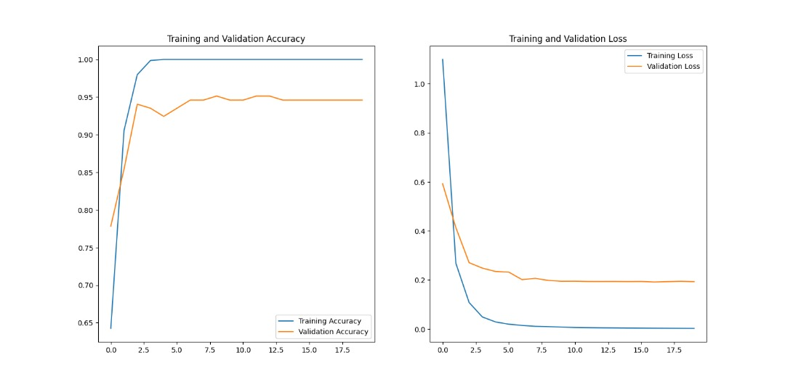

# Dermaid

A web application that classifies nine common skin conditions from an uploaded photograph, using a MobileNetV2 transfer-learning model served through Flask.

Built as my final year project for BSc Computer Engineering at KNUST, 2024.

## This is not a diagnostic tool

It is a classifier trained on a small public dataset for an undergraduate project. It has not been clinically validated, it has not been reviewed by a dermatologist, and it must not be used to make a medical decision.

## What it does

Upload a photograph of a skin condition. The model returns a predicted class along with a plain-language description of that condition and general guidance on next steps.

The nine classes:

| Condition | Type |
|---|---|
| Cellulitis | Bacterial |
| Impetigo | Bacterial |
| Athlete's Foot | Fungal |
| Nail Fungus | Fungal |
| Ringworm | Fungal |
| Cutaneous Larva Migrans | Parasitic |
| Chicken Pox | Viral |
| Shingles | Viral |
| Clear Skin | Negative class |

## The dataset problem

Public dermatology datasets skew heavily toward lighter skin tones. A classifier trained on them will underperform on darker skin, which is exactly the population this project was built for.

That is the motivation for the companion repository, [GAN-FOR-SKIN-COLOUR](https://github.com/radubotchway/GAN-FOR-SKIN-COLOUR), a StarGAN implementation that translates lesion images across skin-tone domains to augment the training set.

## Model

| | |
|---|---|
| Base | MobileNetV2, ImageNet weights, frozen |
| Head | GlobalAveragePooling2D, Dense(128, ReLU), Dense(9, softmax) |
| Input | 128 x 128 RGB, rescaled to [0, 1] |
| Loss | Sparse categorical cross-entropy |
| Optimiser | Adam |
| Training | 20 epochs, 80/20 train and validation split |

MobileNetV2 was chosen for its size. The model has to load and run inference inside a Flask process on modest hardware, which rules out heavier backbones.

The base is frozen, so only the classification head is trained.

## Results



Trained for 20 epochs on 762 labelled images across the nine classes, roughly 85 images
per class, split into training and validation sets.

| Metric | Value |
|---|---|
| Best validation accuracy | 95.2% (epoch 8) |
| Final validation accuracy | ~94.5% |
| Final validation loss | ~0.19 |
| Training accuracy | 100% from epoch 3 onward |
| Inference time | under 10 seconds end to end through the web interface |

Read those numbers with the curves in front of you. Training accuracy reaches 1.0 by the
third epoch and training loss falls to nearly zero, while validation loss flattens at 0.19
and stops improving. That is the model memorising the training set, not continuing to learn
from it. The validation figure is real, but it sits on a validation split of a 762 image
dataset, so a handful of images decide the last percentage point. It is a reasonable result
for the dataset size and it is not a claim about performance on skin the model has never
seen, in lighting it has never seen, on skin tones the dataset barely contains. That last
problem is what the companion repo
[GAN-FOR-SKIN-COLOUR](https://github.com/radubotchway/GAN-FOR-SKIN-COLOUR) was built to
attack.

## Stack

Python, TensorFlow and Keras, OpenCV, Pillow, Flask, SQLite, Jinja2.

## Running it

Requires Python 3.9 or later.

```bash
python -m venv venv
source venv/bin/activate      # Windows: venv\Scripts\activate
pip install -r requirements.txt
python app.py
```

Open http://localhost:5000.

Trained weights ship with the repository at `model/model.weights.h5`, so no training run is needed to try it.

### Retraining

The dataset is not included in this repository. Download the skin disease dataset from Kaggle, extract it, and point `dataset_dir` in `model/train_model.py` at the `train_set` directory.

```bash
python model/train_model.py    # trains and writes weights
python model/test_model.py     # evaluates on the held-out test set
```

## Structure

```
app.py              Flask app: upload, preprocess, predict, render result
model/
  train_model.py    training pipeline
  test_model.py     held-out evaluation
  class_names.txt   ordered class labels, must match softmax output order
  model.weights.h5  trained weights
templates/          index, upload, faq
static/             css, js, images
```

## Known limitations

- The base model is frozen. No fine-tuning pass over the upper base layers was run, which is the most obvious next improvement.
- No data augmentation in the training pipeline.
- Class balance across the nine conditions was not corrected.
- The interface returns a class but does not surface a confidence score, which it should.
- Paths in `model/train_model.py` are hardcoded and should be command-line arguments.

## License

MIT. See [LICENSE](LICENSE).
